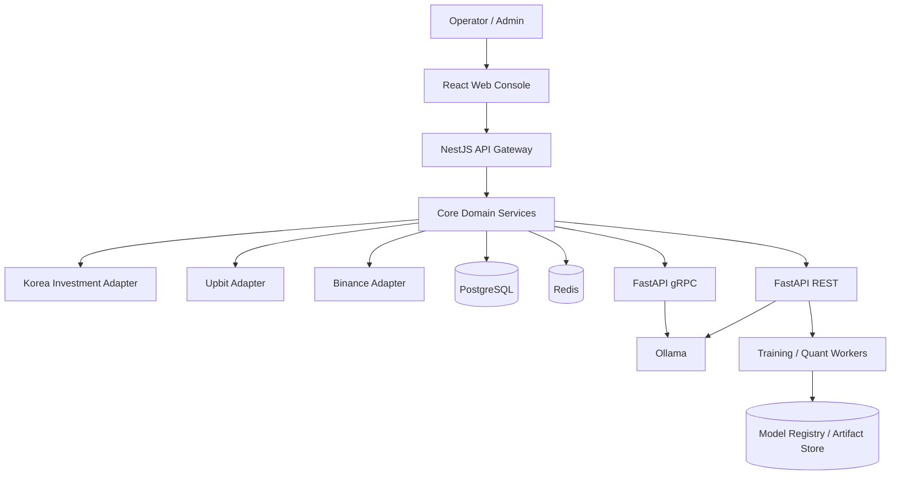
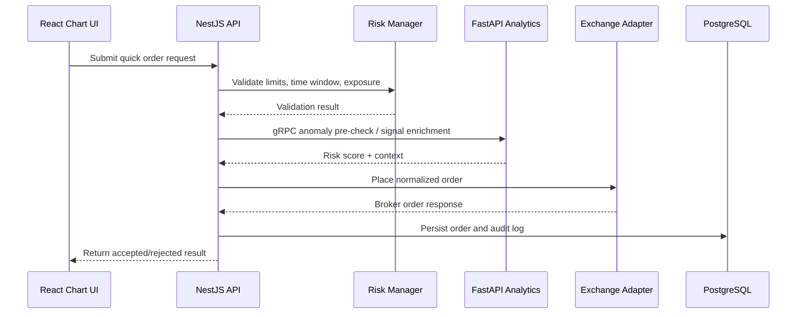

# PODO Architecture Specification

## 1. Purpose

This document defines the initial target architecture for PODO, a hybrid trading operations platform that unifies exchange connectivity, simulation, AI-assisted analytics, and portfolio/risk management within a single operational boundary.

The design principle is explicit:

- intraday systems must prioritize deterministic execution and risk containment,
- after-hours systems may consume spare compute for model training, optimization, and reporting,
- every subsystem must expose auditable state transitions.

## 2. Architectural Principles

### 2.1 Service Boundary

- `NestJS` owns orchestration, operator-facing APIs, policy enforcement, scheduling, and exchange workflows.
- `FastAPI` owns AI inference, portfolio optimization, quant computation, anomaly detection, and training pipelines.
- `React` owns visualization, operator interaction, and chart-based order entry.
- `PostgreSQL` is the system of record.
- `Redis` is the coordination plane for queues, cache, and locks.

### 2.2 Runtime Separation

- `Trading Plane`: order intake, policy validation, market subscriptions, execution tracking, and real-time risk checks.
- `Analytics Plane`: feature generation, inference, optimization, anomaly scoring, and reporting.
- `Training Plane`: batch dataset creation, model tuning, evaluation, and scheduled deployment preparation.

This separation prevents high-latency batch operations from starving order execution paths.

## 3. Context Diagram



## 4. Communication Model

### 4.1 NestJS와 FastAPI 통신 모델

워크로드 특성이 다르기 때문에 두 가지 통신 방식을 병행하는 것을 권장한다.

#### REST

REST는 운영자 중심이거나 저빈도이며 라이프사이클 관리 성격이 강한 요청에 적합하다.

- create a model training job,
- request strategy metadata,
- submit manual rebalancing,
- retrieve historical analytics,
- manage schedules and policy presets.

특징:

- human-readable contracts,
- easier debugging and gateway integration,
- suitable for coarse-grained orchestration.

#### gRPC

gRPC는 내부 서비스 간 호출이며, 스키마가 엄격하고 성능 민감도가 높은 경로에 적합하다.

- anomaly scoring for incoming trade streams,
- portfolio optimization requests with matrix payloads,
- high-frequency signal enrichment,
- batched inference calls from Strategy Engine or Risk Manager.

특징:

- low serialization overhead,
- strongly typed schemas,
- better support for high-volume service-to-service communication.

#### 권장 적용 원칙

- `NestJS -> FastAPI REST`: control plane
- `NestJS -> FastAPI gRPC`: data plane
- `FastAPI -> NestJS`: asynchronous callback through queue/event topics or signed REST webhook when workflow completion must update state

### 4.2 빠른 주문 시퀀스 예시



## 5. Domain Module Layout

The repository should evolve around four business module groups.

```text
packages/
├── core/
│   ├── auth/
│   ├── exchange-router/
│   ├── scheduler/
│   ├── policy-engine/
│   ├── audit-log/
│   └── observability/
├── data/
│   ├── collectors/
│   ├── normalization/
│   ├── market-store/
│   ├── news-pipeline/
│   ├── embeddings/
│   └── feature-store/
├── engine/
│   ├── strategy-engine/
│   ├── execution-engine/
│   ├── backtester/
│   ├── paper-trader/
│   └── signal-runtime/
└── management/
    ├── portfolio-manager/
    ├── risk-manager/
    ├── anomaly-surveillance/
    ├── report-generator/
    └── operations-center/
```

### 5.1 Core

Core is responsible for platform control:

- operator authentication and authorization,
- standardized exchange integration,
- order lifecycle orchestration,
- policy evaluation,
- schedule management,
- telemetry and alert routing.

### 5.2 Data

Data manages raw ingestion and usable features:

- market ticks, candles, orderbook, and fills,
- exchange metadata and calendars,
- news, disclosures, and community content,
- feature extraction and vectorization,
- quality checks and retention policy enforcement.

### 5.3 Engine

Engine converts information into executable actions:

- strategy signal generation,
- live execution routing,
- historical backtesting,
- paper trading replay and virtual fill logic,
- signal enrichment from analytics services.

### 5.4 Management

Management governs portfolio and operating safety:

- expected return and covariance estimation,
- position sizing and capital allocation,
- real-time exposure monitoring,
- abnormal trading surveillance,
- operational reporting and incident workflows.

## 6. Standardized Exchange Interface

The exchange router must define a common contract independent of broker details.

### 6.1 Canonical Interfaces

- `MarketDataProvider`
  - `subscribeTicker()`
  - `subscribeOrderBook()`
  - `getHistoricalCandles()`
- `TradingProvider`
  - `placeOrder()`
  - `cancelOrder()`
  - `getOrder()`
  - `listOpenOrders()`
- `PortfolioProvider`
  - `getBalances()`
  - `getPositions()`
  - `getAccountSnapshot()`
- `ComplianceProvider`
  - `getTradingHours()`
  - `getRateLimitState()`
  - `getExchangeConstraints()`

### 6.2 Normalized DTO Examples

- `NormalizedInstrument`
  - `venue`
  - `symbol`
  - `assetClass`
  - `pricePrecision`
  - `quantityPrecision`
- `NormalizedOrderRequest`
  - `accountId`
  - `venue`
  - `symbol`
  - `side`
  - `type`
  - `price`
  - `quantity`
  - `timeInForce`
  - `clientOrderId`
- `NormalizedFill`
  - `orderId`
  - `executedPrice`
  - `executedQuantity`
  - `fee`
  - `liquidityType`
  - `executedAt`

### 6.3 Venue-Specific Concerns

- `KIS`: domestic trading sessions, account prefixes, market segment metadata, and stricter holiday/session handling.
- `Upbit`: KRW market conventions, websocket event formats, and throttling policies.
- `Binance`: futures/spot separation, symbol filters, and exchange-specific precision constraints.

All venue-specific details stay inside adapters and must not leak into strategy logic.

## 7. Paper Trading Architecture

Paper Trading must mirror live execution while remaining physically and logically isolated.

### 7.1 Isolation Model

- separate virtual account namespace,
- independent order and fill tables or partition key,
- dedicated execution simulator service,
- independent risk budget and policy profile,
- explicit environment tagging in all logs and events.

### 7.2 Execution Flow

1. receive normalized order request from Strategy Engine or UI,
2. validate with paper-specific policies,
3. simulate fill against live market snapshots and configurable slippage model,
4. update virtual positions, cash ledger, and realized/unrealized PnL,
5. emit execution and audit events identical in schema to live trading.

This preserves observability parity between simulation and production.

## 8. AI and Custom Model Training

### 8.1 Ollama 연동

Ollama serves local models for:

- text summarization,
- classification,
- sentiment scoring,
- event extraction,
- strategy assistance prompts.

NestJS should never invoke heavy model logic directly. All model-facing requests pass through FastAPI so inference, retries, batching, and model selection remain centralized.

### 8.2 커스텀 모델 학습 예약 시스템

The custom training reservation system schedules jobs by exchange calendar and infrastructure capacity.

#### 스케줄링 정책

- `Intraday`: inference only, bounded concurrency, strict CPU/GPU quota ceilings.
- `After market close`: feature generation, data labeling, summary pipelines.
- `Night batch`: training, evaluation, embedding refresh, portfolio recalibration.
- `Pre-open`: briefing generation, watchlist scoring, deployment readiness checks.

#### 작업 생명주기

1. scheduler creates a reservation with dataset version and compute budget,
2. FastAPI worker acquires the reservation through Redis lock/queue,
3. training job pulls source data and model recipe,
4. evaluation metrics are persisted,
5. promotion workflow updates active model registry only after threshold checks.

## 9. Portfolio Allocation Engine

The portfolio manager should support both strategic and tactical allocation.

### Inputs

- expected returns from historical and AI-derived signals,
- covariance matrix,
- volatility regime classification,
- liquidity and turnover constraints,
- account- or strategy-level risk budgets,
- hard policy limits such as single-asset caps.

### Outputs

- target weights,
- rebalance actions,
- risk contribution by asset and strategy,
- expected portfolio return and drawdown estimates,
- exception flags when no feasible allocation exists.

### Candidate Algorithms

- mean-variance optimization,
- risk parity,
- hierarchical risk parity,
- constrained max-Sharpe,
- scenario-aware allocation with stress penalties.

## 10. Abnormal Trading Surveillance

Abnormal trading surveillance is a first-class control, not an afterthought.

### Detection Sources

- order stream velocity,
- cancellation burst rate,
- exposure concentration changes,
- deviation from approved strategy behavior,
- API rejection or timeout clusters,
- sudden divergence between intended and realized fill quality.

### Response Levels

- `Level 1`: notify operator and annotate incident,
- `Level 2`: tighten policy thresholds or freeze strategy,
- `Level 3`: kill switch for venue, account, or strategy scope.

The surveillance service should expose both REST incident queries and a gRPC scoring API for real-time checks.

## 11. Data Model Foundations

Initial core tables should include:

- `accounts`
- `exchange_connections`
- `orders`
- `fills`
- `positions`
- `cash_ledger`
- `strategies`
- `strategy_runs`
- `policies`
- `schedule_jobs`
- `model_registry`
- `training_jobs`
- `anomaly_incidents`
- `portfolio_snapshots`
- `audit_logs`

Partitioning recommendations:

- partition large market and execution tables by date,
- separate hot operational tables from cold analytics tables,
- retain immutable audit data for investigations and reporting.

## 12. Deployment Topology

### 12.1 기본 Docker Compose 구성

- `postgres`
- `redis`
- `ollama`
- `api-gateway` (NestJS)
- `ai-service` (FastAPI)
- `web-console` (React)
- optional worker containers for heavy training jobs

### 12.2 운영 권장사항

- pin CPU and memory reservations for trading-plane services,
- isolate GPU-bound training workers when available,
- configure automatic restarts for all long-running containers,
- maintain separate environment files for local, dev, and prod-like modes,
- route alerts to Slack, Telegram, or email for trading failures and job faults.

## 13. Security And Governance

- encrypt exchange credentials at rest,
- minimize credential scope per venue and account,
- separate operator roles for trading, policy admin, and model admin,
- log all manual overrides and emergency actions,
- require signed deployment metadata for model promotion.

## 14. MVP Recommendations

The first implementation should focus on:

1. standardized exchange adapter contracts for KIS, Upbit, and Binance,
2. quick-order flow in React backed by NestJS policy validation,
3. live-data-based paper trading with isolated ledgers,
4. FastAPI inference endpoints backed by Ollama,
5. nightly training reservation and execution framework,
6. portfolio allocation baseline with anomaly surveillance hooks.

## 15. Open Design Decisions

- whether market data fan-out is driven by Redis streams, NATS, or direct websocket multiplexing,
- whether model artifacts live in object storage or a local filesystem registry in early phases,
- whether backtesting and paper trading share a common fill simulation kernel,
- whether gRPC contracts are defined in a standalone shared schema repository.

These decisions can be deferred, but the service contracts defined in this document should remain stable.
